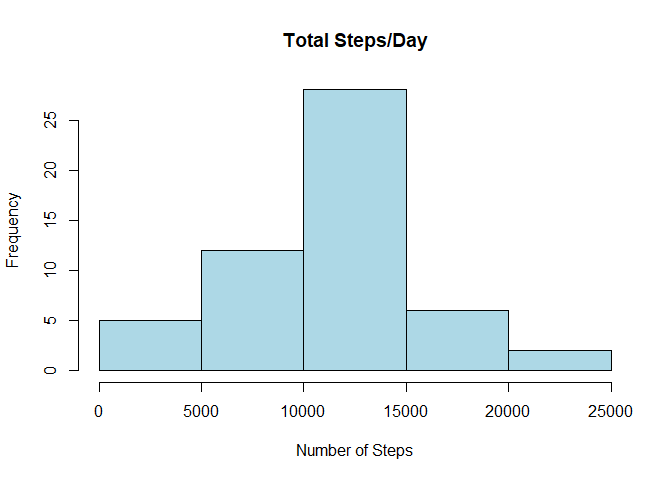
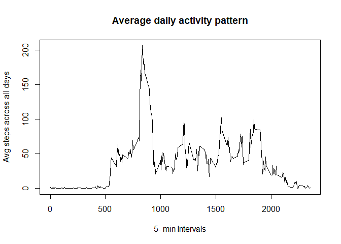
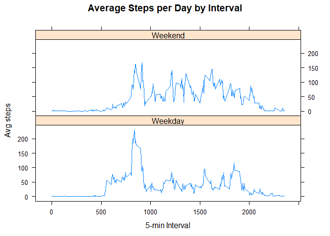

# Reproducible Research: Peer Assessment 1

This assignment will treat data from a **personal activity monitoring device**. This device collects data at **5 minute intervals** through out the day. The data consists of two months of data from an anonymous individual collected during the months of October and November, 2012 and include the number of steps taken in 5 minute intervals each day.

The data can be downloaded at this [web site](https://d396qusza40orc.cloudfront.net/repdata%2Fdata%2Factivity.zip)

The variables included in this dataset are:
-**steps: **Number of steps taking in a 5-minute interval (missing values are coded as NA)
-**date**: The date on which the measurement was taken in YYYY-MM-DD format
-**interval**: Identifier for the 5-minute interval in which measurement was taken
The dataset is stored in a comma-separated-value (CSV) file and there are a total of **17,568 observations** in this dataset.


## Loading and preprocessing the data

```r
if(!exists("activity")){activity <- read.csv("./activity/activity.csv")}
```


## What is mean total number of steps taken per day?


```r
steps_per_day <- aggregate(steps ~ date, activity, sum, na.rm=T)
hist(steps_per_day$steps, main = "Total Steps/Day", col="lightblue", xlab="Number of Steps")
```

<!-- -->


```r
mean_steps <- mean(steps_per_day$steps)
median_steps <- median(steps_per_day$steps)
```

The **mean number** of steps is 1.0766189\times 10^{4} and the **median** is 10765.

## What is the average daily activity pattern?


```r
steps_per_interval <- aggregate(steps ~ interval, activity, mean, na.rm=T)
with(steps_per_interval, plot(interval, steps, type="l", xlab="5- min Intervals", ylab="Avg steps across all days", main = "Average daily activity pattern"))
```

<!-- -->


```r
max_interval <- steps_per_interval[which.max(steps_per_interval$steps),1]
```

The **5-min interval** that refers to maximum number of steps is 835.


## Imputing missing values


```r
missing_data <- sum(is.na(activity$steps))
```

There are 2304 missing values in the dataset.


```r
complete_activity <- activity
for(i in 1:17568){
    if(is.na(complete_activity$steps[i])) {
        interval_i <- match(complete_activity$interval[i],steps_per_interval$interval)
        complete_activity$steps[i] <- steps_per_interval$steps[interval_i]
    }
}
```


```r
steps_per_day_2 <- aggregate(steps ~ date, complete_activity, sum, na.rm=T)
hist(steps_per_day_2$steps, main = "Total Steps/Day", col="lightpink", xlab="Number of Steps")
hist(steps_per_day$steps, main = "Total Steps/Day", col="lightblue", xlab="Number of Steps", add=T)
legend("topright", c("Imputed", "Non-imputed"), col=c("lightpink", "lightblue"), lwd=7)
```

<!-- -->


```r
mean_steps2 <- mean(steps_per_day_2$steps)
median_steps2 <- median(steps_per_day_2$steps)
```

After filling in missing values with average steps per interval, the **mean number** of steps is still the same (1.0766189\times 10^{4}) but the **median** is now slightly higher (1.0766189\times 10^{4}).


## Are there differences in activity patterns between weekdays and weekends?


```
## [1] "LC_COLLATE=English_United States.1252;LC_CTYPE=English_United States.1252;LC_MONETARY=English_United States.1252;LC_NUMERIC=C;LC_TIME=English_United States.1252"
```


```r
complete_activity$day <- as.factor(weekdays(as.Date(complete_activity$date)))
for (i in 1:17568){
    complete_activity$wd[i] <- if (complete_activity$day[i] == "Saturday" || complete_activity$day[i] == "Sunday") {"Weekend"} else {"Weekday"}
}
complete_activity$wd <- as.factor(complete_activity$wd)
steps_per_interval_wd <- aggregate(steps ~ interval + wd, complete_activity, mean, na.rm=T)


library(lattice)
xyplot(steps_per_interval_wd$steps ~ steps_per_interval_wd$interval|steps_per_interval_wd$wd, main="Average Steps per Day by Interval",xlab="5-min Interval", ylab="Avg steps",layout=c(1,2), type="l")
```

<!-- -->

